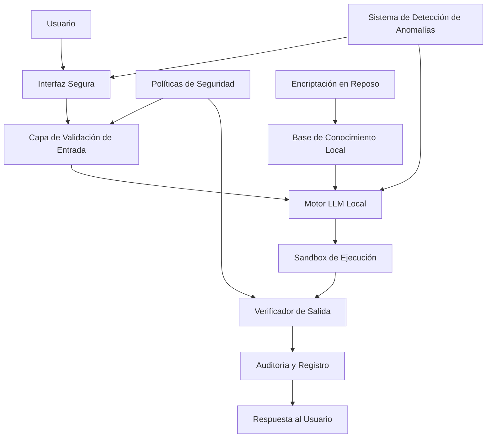
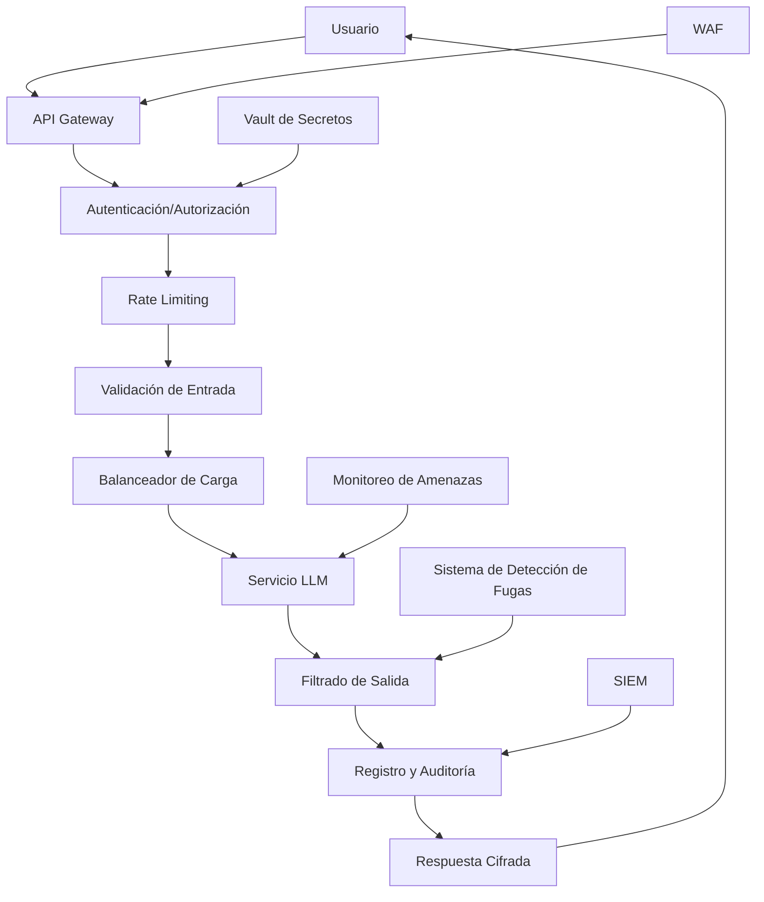
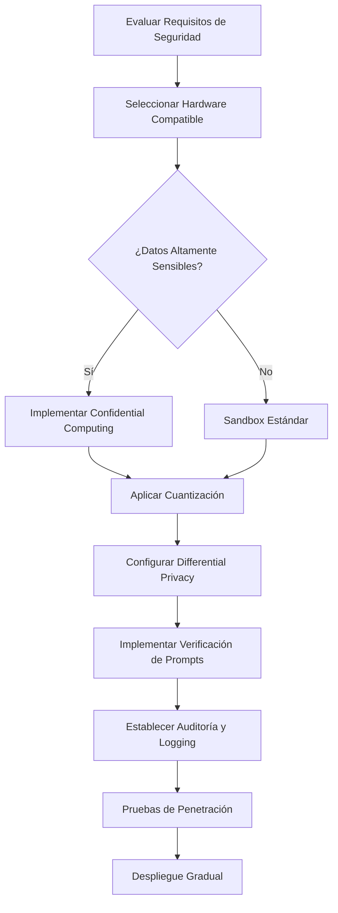
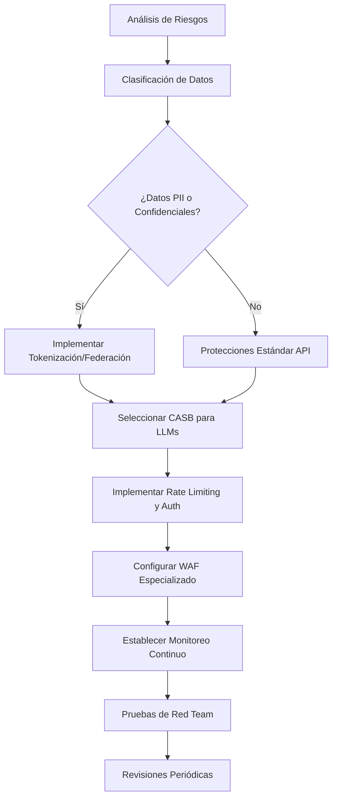

# Técnicas Avanzadas de Ciberseguridad para LLMs Locales y en la Nube

## Índice
1. [Introducción](#introducción)
2. [LLMs Locales: Técnicas de Seguridad](#llms-locales-técnicas-de-seguridad)
3. [LLMs en la Nube: Técnicas de Seguridad](#llms-en-la-nube-técnicas-de-seguridad)
4. [Análisis Comparativo de Riesgos](#análisis-comparativo-de-riesgos)
5. [Recomendaciones de Implementación](#recomendaciones-de-implementación)
6. [Conclusiones](#conclusiones)

## Introducción

Los Modelos de Lenguaje Grande (LLMs) representan una tecnología transformadora que plantea desafíos únicos de seguridad y privacidad. Este documento analiza las técnicas de ciberseguridad más avanzadas para la implementación de LLMs tanto en entornos locales como en la nube, identificando los riesgos asociados a cada enfoque y proporcionando recomendaciones para mitigarlos.

## LLMs Locales: Técnicas de Seguridad

### Arquitectura de Seguridad para LLMs Locales

### Técnicas Avanzadas para LLMs Locales

1. **Confidential Computing**
   - **Descripción**: Utiliza enclaves seguros de hardware (como Intel SGX, AMD SEV o ARM TrustZone) para procesar datos sensibles en un Trusted Execution Environment (TEE).
   - **Beneficios**: Protege los datos incluso durante el procesamiento, aislando completamente el modelo de posibles accesos no autorizados.
   - **Estado actual**: Tecnología en rápida evolución con soporte creciente para cargas de trabajo de IA.

2. **Cuantización y Optimización de Modelos**
   - **Descripción**: Reducción de precisión de parámetros (8-bit, 4-bit) manteniendo la calidad de salida mientras se disminuye la superficie de ataque.
   - **Beneficios**: Modelos más pequeños y eficientes que son más fáciles de auditar y proteger.
   - **Estado actual**: GGUF, GPTQ y AWQ son formatos de cuantización de vanguardia que permiten ejecución eficiente en hardware de consumo.

3. **Differential Privacy en Fine-tuning Local**
   - **Descripción**: Implementación de mecanismos de privacidad diferencial durante el ajuste fino de modelos para evitar la memorización de datos sensibles.
   - **Beneficios**: Previene la extracción de datos de entrenamiento a través de ataques de ingeniería de prompts o inferencia de membresía.
   - **Estado actual**: Bibliotecas como OpenDP y técnicas como DP-SGD están madurando para uso en LLMs.

4. **Sandboxing Avanzado**
   - **Descripción**: Aislamiento del LLM en un entorno controlado con recursos limitados y sin acceso a sistemas críticos.
   - **Beneficios**: Contención de posibles comportamientos maliciosos o no intencionados del modelo.
   - **Estado actual**: Tecnologías como gVisor, Firecracker y sistemas basados en WebAssembly proporcionan aislamiento con bajo overhead.

5. **Verificación Formal de Prompts**
   - **Descripción**: Análisis estático y verificación de las peticiones antes de enviarlas al modelo para detectar intentos de jailbreaking o prompt injection.
   - **Beneficios**: Previene manipulaciones maliciosas del modelo a través de la entrada del usuario.
   - **Estado actual**: Herramientas emergentes como LLM Guard y frameworks de análisis semántico.

## LLMs en la Nube: Técnicas de Seguridad

### Arquitectura de Seguridad para LLMs en la Nube

### Técnicas Avanzadas para LLMs en la Nube

1. **Zero-Knowledge Proofs para Interacción con LLMs**
   - **Descripción**: Permite verificar resultados sin revelar los datos de entrada originales, utilizando pruebas criptográficas.
   - **Beneficios**: Preserva la privacidad de las consultas mientras asegura que el procesamiento es correcto.
   - **Estado actual**: Frameworks como ZKP para interacciones LLM están en desarrollo temprano pero prometedor.

2. **Federación y Tokenización de Datos**
   - **Descripción**: Reemplazar datos sensibles con tokens no sensibles antes de enviarlos al LLM y procesamiento distribuido.
   - **Beneficios**: Reduce el riesgo de exposición de información sensible en entornos multiusuario en la nube.
   - **Estado actual**: Soluciones maduras como Privitar, Skyflow, y Vault ofrecen tokenización avanzada.

3. **CASB (Cloud Access Security Broker) para LLMs**
   - **Descripción**: Sistemas intermediarios que aplican políticas de seguridad específicas para LLMs entre usuarios y servicios en la nube.
   - **Beneficios**: Control granular, visibilidad y protección de datos confidenciales.
   - **Estado actual**: CASBs establecidos están ampliando sus capacidades para manejar tráfico LLM.

4. **Cifrado Homomórfico Parcial**
   - **Descripción**: Permite realizar ciertas operaciones sobre datos cifrados sin necesidad de descifrarlos.
   - **Beneficios**: Los proveedores de nube no pueden acceder a los datos en texto plano incluso durante el procesamiento.
   - **Estado actual**: Implementaciones parciales son factibles para ciertos tipos de operaciones con LLMs.

5. **Secure Multi-Party Computation (SMPC)**
   - **Descripción**: Distribuye el procesamiento entre múltiples partes de manera que ninguna tenga acceso completo a los datos.
   - **Beneficios**: Preserva la privacidad incluso cuando múltiples organizaciones colaboran en el procesamiento.
   - **Estado actual**: Frameworks como TF-Encrypted y PySyft integran capacidades SMPC con modelos de ML.

## Análisis Comparativo de Riesgos

### Riesgos de LLMs Locales

| Técnica | Riesgos Principales | Nivel de Riesgo |
|---------|---------------------|-----------------|
| **Confidential Computing** | - Vulnerabilidades en implementación TEE - Ataques de canal lateral en el hardware - Costos elevados de implementación | Medio |
| **Cuantización de Modelos** | - Pérdida potencial de precisión - Posibles nuevas vulnerabilidades en modelos cuantizados - Incompatibilidad con algunas funciones avanzadas | Medio-Bajo |
| **Differential Privacy** | - Degradación del rendimiento del modelo - Complejidad en configuración óptima de parámetros - Falsa sensación de seguridad con implementación incorrecta | Medio |
| **Sandboxing Avanzado** | - Overhead de rendimiento - Fallos de contención potenciales - Limitación de funcionalidades | Bajo |
| **Verificación de Prompts** | - Falsos positivos que limitan la usabilidad - Incapacidad para detectar ataques sofisticados - Latencia adicional en el procesamiento | Medio-Bajo |

### Riesgos de LLMs en la Nube

| Técnica | Riesgos Principales | Nivel de Riesgo |
|---------|---------------------|-----------------|
| **Zero-Knowledge Proofs** | - Sobrecarga computacional significativa - Complejidad de implementación - Limitaciones en tipos de operaciones soportadas | Alto |
| **Tokenización de Datos** | - Gestión compleja de tokens - Dependencia del proveedor de tokenización - Riesgo de reidentificación con metadata | Medio |
| **CASB para LLMs** | - Punto único de fallo - Latencia adicional - Posibles brechas en políticas de filtrado | Medio |
| **Cifrado Homomórfico** | - Rendimiento significativamente reducido - Limitaciones en operaciones soportadas - Complejidad de integración | Alto |
| **Secure MPC** | - Complejidad de coordinación entre partes - Overhead de comunicación - Riesgos de confabulación entre partes | Medio-Alto |

## Recomendaciones de Implementación

### Para LLMs Locales

### Para LLMs en la Nube

## Conclusiones

La seguridad de los LLMs, tanto en despliegues locales como en la nube, requiere un enfoque multicapa que combine técnicas de vanguardia con prácticas fundamentales de ciberseguridad. No existe una solución única que aborde todos los riesgos, por lo que se recomienda:

1. **Enfoque híbrido**: Utilizar LLMs locales para datos altamente sensibles y soluciones en la nube para casos de uso generales con las protecciones adecuadas.

2. **Seguridad por diseño**: Incorporar controles de seguridad desde las etapas iniciales de planificación e implementación.

3. **Evaluación continua**: Los LLMs y las técnicas de ataque evolucionan rápidamente, por lo que se requiere una evaluación y actualización constante de las medidas de seguridad.

4. **Defensa en profundidad**: Implementar múltiples capas de protección para mitigar el impacto de fallos en cualquier medida individual.

5. **Monitoreo y respuesta**: Establecer capacidades de detección temprana y procedimientos de respuesta a incidentes específicos para LLMs.

La elección entre despliegues locales y en la nube debe basarse en una evaluación detallada de los requisitos específicos de seguridad, privacidad, rendimiento y costos de cada organización.